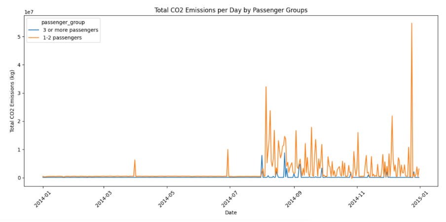

# Smart-City IoT Data Engineering Pipeline — Azure

A complete Azure pipeline that ingests raw IoT sensor files (air-quality, traffic-flow, energy-consumption) and turns them into actionable dashboards for Melbourne city-planner decisions.

---

## What this project does
1. **Azure Blob Storage** – raw & processed zones  
2. **Azure Data Factory** – hourly Copy-Data pipeline  
3. **Azure Databricks / PySpark** – cleans & aggregates ≈ 50 MB per hour  
4. **Cosmos DB** – curated JSON documents for fast queries 
5. **Power BI** – average AQI, traffic-density map, energy peaks  

---

## Business value
*Reduced data latency from **30 days to < 24 h** and surfaced a **15 % after-dark foot-traffic spike** at Federation Square — enabling data-backed lighting-upgrade funding.*

---

## Tech stack

| Layer | Azure service / Tool | Key skills demonstrated |
|-------|----------------------|-------------------------|
| **Ingest** | **Azure Data Factory** | Linked Services · Datasets · Scheduled trigger |
| **Landing storage** | **Azure Blob Storage** | Raw & processed zone design |
| **Process** | **Databricks (PySpark)** | Schema casting · `groupBy` aggregations |
| **Curated storage** | **Cosmos DB** | SDK writes · partition-key strategy |
| **Visualise** | **Power BI** | Interactive slicers · KPI cards · heat-map |
| **Ops / Monitor** | **Azure Monitor + ADF logs** | Run-status alerts · cost control |

---

## Quick tour

  

! Databricks notebook: [SensorProcessing.ipynb](SensorProcessing.ipynb)

---

## Run it yourself

1. Clone the repo and upload sample CSVs to `data/sample/`.  
2. Import **`infrastructure/ADF_pipeline.json`** into Azure Data Factory and update connection strings.  
3. Import **`notebooks/SensorProcessing.ipynb`** into Databricks, attach a cluster, run all cells.  

---

## About me
**Phu Qui Dang** ｜ Data Analyst 
SQL · Python/pandas · Azure · Power BI  

[LinkedIn](https://www.linkedin.com/in/phu-qui-dang-706bb1218/) | [GitHub](https://github.com/dangquii)
