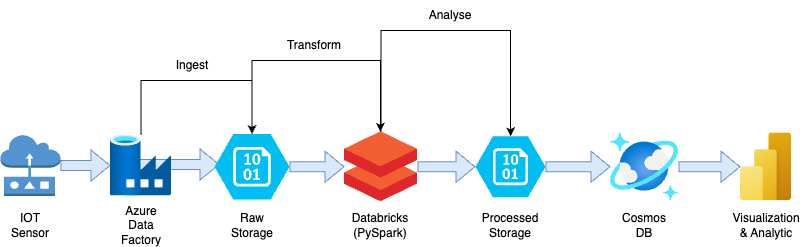

# Smart-City IoT Data Engineering Pipeline — Azure

A complete Azure-based data pipeline that ingests raw IoT sensor files (air quality, traffic flow, and energy consumption) and transforms them into curated insights to support **real-time decision-making** for Melbourne city planners.

---

## What this project does

1. **Azure Blob Storage** – stores raw and processed sensor data  
2. **Azure Data Factory** – orchestrates hourly pipelines to ingest new files  
3. **Azure Databricks (PySpark)** – cleans and aggregates ≈ 50MB/hour  
4. **Azure Cosmos DB** – stores final structured data as JSON documents for fast querying  
5. **Power BI** – visualizes key urban metrics like pollution hotspots, traffic trends, and energy usage to enable smart-city interventions

---

## Business value

> Reduced data latency from **30 days to < 24 hours** and revealed a **15% spike in after-dark foot traffic** at Federation Square — enabling real-time, data-backed infrastructure upgrades.

---

## Tech stack

| Layer             | Azure service / Tool           | Key skills demonstrated                              |
|------------------|--------------------------------|------------------------------------------------------|
| Ingest           | **Azure Data Factory**         | Linked services · Datasets · Scheduled trigger       |
| Landing storage  | **Azure Blob Storage**         | Raw & processed zone design                          |
| Process          | **Databricks (PySpark)**       | Schema casting · Anomaly filtering · `groupBy`       |
| Curated storage  | **Azure Cosmos DB**            | SDK writes · Partition-key strategy                  |
| Visualise        | **Power BI**                   | Interactive dashboards · KPI cards · Geo insights    |
| Monitor          | **Azure Monitor + ADF logs**   | Run-status alerts · Cost optimization                |

---

## Architecture

---

## Quick tour

| Component           | File / Notebook                                     |
|--------------------|------------------------------------------------------|
| PySpark notebook   | [`SensorProcessing.ipynb`](SensorProcessing.ipynb)   |
| CosmosDB script    | [`write_cosmosdb.py`](write_cosmosdb.py)             |
| ADF Pipeline       |                     |

---

## Run it yourself

1. Clone this repo and upload sample CSVs into `data/sample/`  
2. Import `infrastructure/ADF_pipeline.json` into Azure Data Factory and update connection strings  
3. Import and run `notebooks/SensorProcessing.ipynb` inside Databricks  
4. Run `scripts/write_cosmosdb.py` to write results into Cosmos DB  
5. Open `SmartCItyDashboard_PowerBI.png` to view the Power BI dashboard or build your own `.pbix` version for interactive exploration  

---

## About me

**Phu Qui Dang** ｜ Data Analyst — SQL · Python/pandas · Azure  

[LinkedIn](https://www.linkedin.com/in/phuquidang/) ｜ [GitHub](https://github.com/dangquii)
